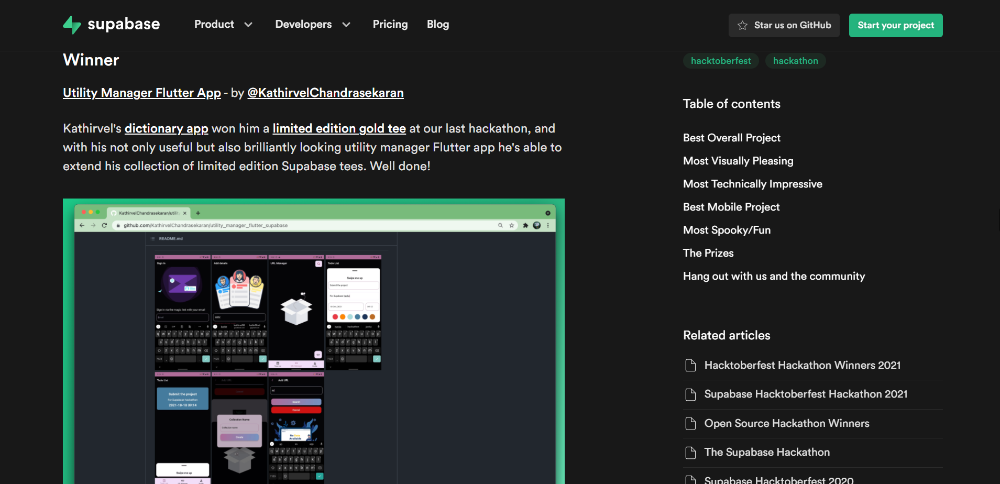

## App for Supabase Hacktoberfest 🚀

# Utility Manager Flutter Application!

Utility Manager Flutter Application is made with Flutter and Supabase which allows user to add task, set remainder to the task, set color to separate tasks and it allows to add URL with URL's informations.  

# Supabase Hacktoberfest winner announcement

[Best Mobile Project](https://supabase.io/blog/2021/10/14/hacktoberfest-hackathon-winners-2021)

# Usage of Supabase ❣️ in this app

- Supabase Auth
- Supabase Storage
- Supabase Database
- Supabase Realtime

# Used API's

Utility Manager Flutter Application use **Open Source API's** to meet the purpose of the app.

[URL Meta](https://urlmeta.org/)

# Demo

            
